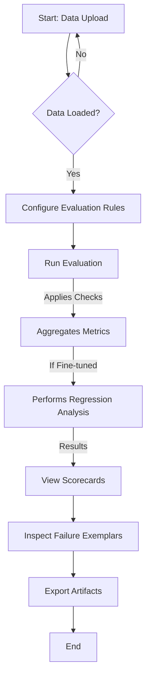

id: 69713286f1dd2fc1624a1901_documentation
summary: Lab 8: LLM Evaluation Harness (Inference & Fine-Tuning Risk) Documentation
feedback link: https://docs.google.com/forms/d/e/1FAIpQLSfWkOK-in_bMMoHSZfcIvAeO58PAH9wrDqcxnJABHaxiDqhSA/viewform?usp=sf_link
environments: Web
status: Published
# QuLab: Lab 8: LLM Evaluation Harness for Inference & Fine-Tuning Risk

## 1. Setting the Stage: Introduction and Application Overview
Duration: 05:00

Welcome to QuLab: Lab 8, a comprehensive guide to understanding and utilizing an LLM Evaluation Harness designed to assess the trustworthiness and identify risks associated with Large Language Models (LLMs) in both inference and fine-tuning scenarios. This codelab will provide developers with a detailed walkthrough of a Streamlit application that acts as an auditing tool for LLMs.

### The Challenge: Ensuring LLM Trustworthiness
In today's rapidly evolving AI landscape, organizations like InnovateCorp are increasingly deploying LLMs in critical applications, such as internal knowledge assistants powered by Retrieval Augmented Generation (RAG). While powerful, LLMs introduce new risks:
*   **Hallucinations:** Generating factually incorrect or unsupported information.
*   **Lack of Faithfulness:** Failing to attribute information correctly to provided sources.
*   **Refusal to Answer:** Overly cautious or inappropriate refusals, impacting user experience.
*   **Over-compliance:** Excessive disclaimers or verbose, unhelpful responses.
*   **Regression from Fine-Tuning:** Fine-tuning an LLM to improve one aspect might inadvertently degrade performance or introduce new risks in others.

This evaluation harness empowers an auditor, **Alex**, to systematically assess these risks. The findings are then crucial for a **Maria**, the Model Validator, to make informed decisions about model deployment, and for **David**, the AI Risk Lead, to ensure compliance and manage organizational risk.

### Core Concepts Explained
The application focuses on evaluating LLMs against several critical dimensions:
*   **Hallucination Proxy:** Identifying outputs that are excessively verbose, contain over-specific unverified details, or factual claims unsupported by provided context.
*   **Faithfulness to Sources:** Ensuring the LLM correctly cites provided sources and does not invent references or make assertions outside its allowed context.
*   **Refusal & Over-Compliance:** Detecting when an LLM inappropriately refuses to answer or provides excessive, unnecessary safety disclaimers.
*   **Regression Analysis:** Quantitatively comparing a baseline LLM against a fine-tuned version to detect any degradation in performance across key metrics.

By understanding these concepts and using this tool, developers can build more robust, reliable, and trustworthy LLM-powered applications.

### Application Architecture and Workflow
The Streamlit application provides an end-to-end workflow for LLM evaluation. Here's a high-level overview of the data flow and processes:



This diagram illustrates how data flows from initial upload through a series of configurable evaluation steps, culminating in visual scorecards, detailed failure analyses, and exportable audit artifacts.

## 2. Data Preparation and Upload
Duration: 10:00

As Alex, the first crucial step is to gather and load the necessary data for evaluation. This includes the test prompts, the outputs from the baseline LLM, and if available, the outputs from a fine-tuned LLM. This step ensures that the subsequent evaluation process has a complete and correctly aligned dataset to work with.

The application expects input data in CSV format, with specific column names:
*   **Prompt Set (`sample_prompts.csv`):**
    *   `prompt_id`: Unique identifier for each prompt.
    *   `prompt_text`: The actual text of the prompt.
    *   `expected_answer` (Optional): A reference answer for direct comparison.
    *   `allowed_sources` (Optional, JSON string): Specifies relevant documents or knowledge base entries for RAG contexts, used for faithfulness checks.
*   **Model Outputs (`sample_baseline_outputs.csv`, `sample_finetuned_outputs.csv`):**
    *   `prompt_id`: To link outputs back to their respective prompts.
    *   `llm_output`: The generated response from the LLM.
    *   `sources_cited` (Optional, JSON string): Any sources explicitly mentioned by the LLM in its response.

<aside class="positive">
<b>Best Practice:</b> Ensure your `prompt_id` columns are consistent across all CSV files to prevent data misalignment issues during the merging process. `allowed_sources` and `sources_cited` should be valid JSON string representations of lists or arrays if present, as they will be parsed by the evaluation logic.
</aside>

### Loading Sample Data

For a quick start, the application provides pre-generated sample data.

1.  Navigate to the "1. Data Upload" page in the sidebar.
2.  Click the "Load Sample Data" button.

This action triggers the `source.generate_mock_data()` function to create local sample CSV files, followed by `source.load_evaluation_data()` which reads these files and merges them into a single DataFrame stored in `st.session_state.eval_df`.

```python
# From the Streamlit application code
if st.button("Load Sample Data"):
    with st.spinner("Generating and loading mock data..."):
        source.generate_mock_data() # Ensure mock files exist
        st.session_state.eval_df, st.session_state.is_finetuned_comparison = source.load_evaluation_data(
            "sample_prompts.csv", "sample_baseline_outputs.csv", "sample_finetuned_outputs.csv"
        )
        st.success("Sample data loaded successfully!")
        st.rerun()
```

### Uploading Your Own Data

Alternatively, you can upload your custom datasets using the provided file uploaders.

1.  Prepare your `prompts.csv`, `baseline_outputs.csv`, and optionally `finetuned_outputs.csv` files according to the specified schema.
2.  Use the `st.file_uploader` widgets to upload each file.
3.  Once the required files (Prompts and Baseline Outputs) are uploaded, the "Load Uploaded Data" button will become active. Click it to process your data.

```python
# From the Streamlit application code
uploaded_prompts_file = st.file_uploader("Upload Prompts CSV", type=["csv"], key="prompts_uploader")
uploaded_baseline_file = st.file_uploader("Upload Baseline Outputs CSV", type=["csv"], key="baseline_outputs_uploader")
uploaded_finetuned_file = st.file_uploader("Upload Fine-Tuned Outputs CSV (Optional)", type=["csv"], key="finetuned_outputs_uploader")

# ... (logic to store uploaded files in session_state) ...

if st.button("Load Uploaded Data", disabled=not load_uploaded_data_button_enabled):
    with st.spinner("Loading uploaded data..."):
        # Temporary save to disk for source.load_evaluation_data
        # ...
        st.session_state.eval_df, st.session_state.is_finetuned_comparison = source.load_evaluation_data(
            prompts_path, baseline_path, finetuned_path
        )
        st.success("Uploaded data loaded successfully!")
        st.rerun()
```

After successfully loading data (either sample or uploaded), a sample of the combined evaluation DataFrame (`st.session_state.eval_df`) will be displayed, allowing you to verify that prompts are correctly matched with their respective model outputs. This `eval_df` is the foundational dataset for all subsequent evaluation steps.

## 3. Configure Evaluation Rules
Duration: 15:00

This step allows Alex to define the specific parameters and thresholds that will govern the LLM evaluation. Customizing these rules ensures that the evaluation aligns precisely with InnovateCorp's risk profile and the intended use case of the LLM. All configurations are stored in `st.session_state.eval_config`.

Navigate to the "2. Configure Evaluation Rules" page in the sidebar.

### Hallucination Proxy Settings
These settings help detect potential hallucinations by analyzing output length and the presence of specific keywords.

*   **Hallucination Threshold Ratio:**
    $$ R = \frac{\text{word\_count}(\text{LLM Output})}{\text{word\_count}(\text{Prompt Text})} $$
    This ratio helps identify excessively verbose outputs that might indicate "bullshitting" or hallucination. A higher ratio might mean the LLM is generating more content than necessary relative to the prompt.
    ```python
    st.session_state.eval_config['hallucination_threshold_ratio'] = st.number_input(
        r"Hallucination Threshold Ratio ($$ R = \frac{\text{length}(\text{LLM Output})}{\text{length}(\text{Prompt Text})} $$)",
        value=current_hallucination_threshold_ratio,
        min_value=0.0, max_value=10.0, step=0.01,
        help="If the ratio of LLM output length (word count) to prompt length (word count) exceeds this, it may indicate excessive verbosity or hallucination."
    )
    ```

*   **Over-Specificity Keywords:**
    Keywords that, when found in conjunction with unverified numerical details, may signal over-specificity hallucinations (e.g., claiming "exactly 3.14 units" without a verifiable source).
    ```python
    new_over_specificity_keywords = st.text_area(
        "Over-Specificity Keywords (comma-separated)",
        value=current_over_specificity_keywords,
        help="Keywords that, when present with unverified numerical details, may indicate over-specificity hallucinations. E.g., 'exactly', 'precisely'."
    )
    st.session_state.eval_config['over_specificity_keywords'] = [
        kw.strip() for kw in new_over_specificity_keywords.split(',') if kw.strip()
    ]
    ```

### Refusal and Over-Compliance Settings
These rules identify patterns where the LLM might be inappropriately refusing to answer or providing excessive safety disclaimers.

*   **Refusal Phrases:**
    Specific phrases that indicate the LLM is declining to answer the prompt.
    ```python
    new_refusal_phrases = st.text_area(
        "Refusal Phrases (one per line)",
        value=current_refusal_phrases,
        height=150,
        help="Phrases that identify a refusal to answer a prompt. E.g., 'I cannot answer questions that involve'."
    )
    st.session_state.eval_config['refusal_phrases'] = [
        phrase.strip() for phrase in new_refusal_phrases.split('\n') if phrase.strip()
    ]
    ```

*   **Excessive Safety Disclaimers:**
    Phrases that suggest the LLM is being overly cautious or providing unnecessary disclaimers.
    ```python
    new_excessive_safety_disclaimers = st.text_area(
        "Excessive Safety Disclaimers (one per line)",
        value=current_excessive_safety_disclaimers,
        height=150,
        help="Phrases that indicate overly cautious or unnecessary disclaimers. E.g., 'Please consult a professional'."
    )
    st.session_state.eval_config['excessive_safety_disclaimers'] = [
        phrase.strip() for phrase in new_excessive_safety_disclaimers.split('\n') if phrase.strip()
    ]
    ```

### Regression Analysis Settings
This setting is crucial for comparing a fine-tuned model against a baseline and detecting undesirable changes.

*   **Regression Threshold Delta:**
    A percentage increase in negative metrics (e.g., hallucination rate) beyond this threshold will flag a regression.
    ```python
    st.session_state.eval_config['regression_threshold_delta'] = st.number_input(
        "Regression Threshold Delta",
        value=current_regression_threshold_delta,
        min_value=0.0, max_value=1.0, step=0.01,
        help="A percentage increase in negative metrics (e.g., hallucination rate) beyond this threshold will flag a regression."
    )
    ```

### Citation Pattern
A regular expression used to identify citations within the LLM's output. This is vital for faithfulness checks.

*   **Citation Pattern (regex):**
    ```python
    st.session_state.eval_config['citation_pattern'] = st.text_input(
        "Citation Pattern (regex)",
        value=current_citation_pattern,
        help="Regular expression for detecting citations (e.g., [1], [2])."
    )
    ```

After making any changes, the "Current Evaluation Configuration" section will update, displaying the JSON representation of your `eval_config`. This ensures transparency and allows verification of the active rules.

## 4. Running the Evaluation Harness
Duration: 05:00

With the data loaded and evaluation rules configured, Alex is now ready to execute the complete evaluation harness. This step applies all defined checks to each LLM output and then aggregates these findings into summary metrics. This process provides Maria, the Model Validator, with a high-level understanding of the LLM's trustworthiness and any observed regressions.

Navigate to the "3. Run Evaluation" page in the sidebar.

### Executing the Evaluation
Click the "Run Evaluation" button. This will trigger a series of backend functions from `source.py` that perform the analysis.

<aside class="negative">
<b>Warning:</b> Ensure you have loaded evaluation data on the "Data Upload" page before attempting to run the evaluation. The button will be disabled if no data is present in `st.session_state.eval_df`.
</aside>

```python
# From the Streamlit application code
if st.button("Run Evaluation", disabled=st.session_state.eval_df.empty):
    if st.session_state.eval_df.empty:
        st.warning("Please load evaluation data first on the 'Data Upload' page.")
    else:
        # Update source.EVAL_CONFIG with the user-configured session state
        if hasattr(source, 'EVAL_CONFIG') and isinstance(source.EVAL_CONFIG, dict):
            source.EVAL_CONFIG.update(st.session_state.eval_config)
        
        with st.spinner("Applying hallucination checks..."):
            st.session_state.eval_df = source.apply_hallucination_checks(st.session_state.eval_df.copy(), st.session_state.is_finetuned_comparison)
        with st.spinner("Applying faithfulness checks..."):
            st.session_state.eval_df = source.apply_faithfulness_checks(st.session_state.eval_df.copy(), st.session_state.is_finetuned_comparison)
        with st.spinner("Applying refusal and over-compliance checks..."):
            st.session_state.eval_df = source.apply_refusal_checks(st.session_state.eval_df.copy(), st.session_state.is_finetuned_comparison)
        
        with st.spinner("Aggregating metrics..."):
            st.session_state.eval_df, st.session_state.aggregate_metrics = source.run_evaluation_and_aggregate(st.session_state.eval_df.copy(), st.session_state.is_finetuned_comparison)
        
        if st.session_state.is_finetuned_comparison:
            with st.spinner("Performing regression analysis..."):
                st.session_state.regression_analysis_results = source.perform_regression_analysis(st.session_state.aggregate_metrics)
        else:
            st.session_state.regression_analysis_results = {}
        
        st.success("Evaluation complete! You can now view scorecards and inspect failure exemplars.")
        st.rerun()
```

During this process, the application performs the following key steps:
1.  **Hallucination Checks:**
    *   `excessive_length_flag`: Flags outputs exceeding the configured `hallucination_threshold_ratio`.
    *   `over_specificity_flag`: Flags outputs containing `over_specificity_keywords` with unverified numerical data.
    *   `unsupported_factual_claim_flag`: (Assumed from `source.py` based on `allowed_sources` and output content, typically requiring an LLM judge or more complex NLU).
2.  **Faithfulness Checks:**
    *   `missing_allowed_source_flag`: Checks if the LLM output's claims are covered by the `allowed_sources` for RAG.
    *   `out_of_scope_reference_flag`: Flags if the LLM references sources outside of `allowed_sources`.
    *   `uncited_assertion_flag`: Flags claims made without a corresponding citation, detected by `citation_pattern`.
3.  **Refusal and Over-Compliance Checks:**
    *   `refusal_flag`: Detects if the output contains any `refusal_phrases`.
    *   `excessive_disclaimer_flag`: Identifies `excessive_safety_disclaimers`.
    *   `inappropriate_refusal_flag`: A combined flag indicating a refusal where it might not be appropriate (e.g., if the prompt was innocuous).
4.  **Metric Aggregation:** Calculates overall rates for each flag (e.g., `hallucination_rate`, `refusal_rate`) and possibly composite scores (e.g., `faithfulness_score`) for both baseline and fine-tuned models.
5.  **Regression Analysis (if applicable):** If fine-tuned outputs were provided, it compares the aggregate metrics between the baseline and fine-tuned models and flags any regressions exceeding the `regression_threshold_delta`.

Upon successful completion, a success message will appear, and you can proceed to view the results.

## 5. Visualizing Results and Aggregated Metrics
Duration: 10:00

After running the evaluation, Alex needs to present the findings clearly to Maria and David. This page provides visual scorecards and aggregate metrics that summarize the LLM's performance, making it easier to grasp strengths, weaknesses, and any regressions.

Navigate to the "4. View Scorecards" page in the sidebar.

### Aggregate Scorecard
The first section displays a table of aggregate metrics, showing rates (as percentages) for various issues for each model (baseline and fine-tuned). This gives an immediate, high-level overview of the models' trust posture.

```python
# From the Streamlit application code
metrics_to_display = {model: {k: v for k, v in data.items() if k != 'total_prompts'} for model, data in st.session_state.aggregate_metrics.items()}
metrics_df = pd.DataFrame.from_dict(metrics_to_display, orient='index')
st.dataframe(metrics_df.style.format("{:.2%}").set_caption("LLM Evaluation Metrics"))
```

This table typically includes metrics like:
*   `hallucination_rate`
*   `faithfulness_score`
*   `refusal_rate`
*   `inappropriate_refusal_rate`
*   And other specific flag rates.

### Comparison of Key LLM Evaluation Metrics
A bar chart visually compares the most important metrics between the baseline and fine-tuned models. This visual representation helps in quickly identifying performance differences.

```python
# From the Streamlit application code
plt.figure(figsize=(12, 6))
metrics_to_plot = ['hallucination_rate', 'faithfulness_score', 'refusal_rate', 'inappropriate_refusal_rate']
plot_data = []
for model_prefix in ['baseline'] + (['finetuned'] if st.session_state.is_finetuned_comparison else []):
    for metric in metrics_to_plot:
        metric_value = st.session_state.aggregate_metrics[model_prefix].get(metric, 0)
        plot_data.append({'Model': model_prefix.capitalize(), 'Metric': metric.replace('_', ' ').title(), 'Value': metric_value})

plot_df = pd.DataFrame(plot_data)

if not plot_df.empty:
    sns.barplot(x='Metric', y='Value', hue='Model', data=plot_df)
    plt.title('Comparison of Key LLM Evaluation Metrics')
    plt.ylabel('Rate / Score')
    plt.ylim(0, 1)
    st.pyplot(plt)
    plt.clf()
```

This chart clearly shows, for instance, if the fine-tuned model has a lower hallucination rate but perhaps a slightly higher refusal rate.

### Fine-Tuning Regression Analysis
If fine-tuned outputs were provided and evaluated, this section presents the results of the regression analysis. It highlights the change (delta) in each metric and explicitly flags any metrics that show a regression (i.e., worsened performance beyond the `regression_threshold_delta`).

```python
# From the Streamlit application code
if st.session_state.is_finetuned_comparison:
    st.markdown(f"#### Fine-Tuning Regression Analysis")
    if st.session_state.regression_analysis_results:
        for metric, delta in st.session_state.regression_analysis_results['deltas'].items():
            st.markdown(f"**{metric.replace('_', ' ').title()} Delta:** `{delta:+.4f}`")
        
        if st.session_state.regression_analysis_results['regressions_flagged']:
            st.error("!!! REGRESSION DETECTED !!!")
            for flagged_metric in st.session_state.regression_analysis_results['flagged_metrics']:
                st.markdown(f"- {flagged_metric.replace('_', ' ').title()}")
        else:
            st.success("No regressions detected beyond threshold. Fine-tuning appears stable or improved.")
```

This quantitative evidence is critical for Maria to determine if the fine-tuned model is ready for release or requires further refinement to address specific regressions.

## 6. Inspect Failure Exemplars
Duration: 10:00

While aggregate metrics provide a high-level view, specific examples of model failures are invaluable for understanding *why* a model performs as it does and for identifying root causes. This section allows Alex to delve into individual "high-risk" prompts.

Navigate to the "5. Inspect Failure Exemplars" page in the sidebar.

### Identifying and Displaying High-Risk Prompts
The application filters the `eval_df` to identify prompts where at least one issue (hallucination, faithfulness, or refusal) was flagged for either the baseline or fine-tuned model. It then displays up to 5 such examples for detailed inspection.

```python
# From the Streamlit application code (simplified)
filtered_df['is_any_high_risk'] = False
for flag_suffix in flag_suffixes: # Loops through all defined flag types
    baseline_col = f'baseline_{flag_suffix}'
    if baseline_col in filtered_df.columns:
        filtered_df['is_any_high_risk'] = filtered_df['is_any_high_risk'] | filtered_df[baseline_col]
    # ... similar for finetuned_col ...

failure_ids_df = filtered_df[filtered_df['is_any_high_risk']].head(5)
# ... then iterates through failure_ids_df to display each exemplar ...
```

For each selected prompt, the following information is displayed:
*   **Prompt ID and Text:** The original query.
*   **Allowed Sources (if available):** The context provided to the LLM (crucial for RAG evaluation).
*   **Expected Answer (if available):** The desired outcome.
*   **Baseline Model Output:** The LLM's response, its cited sources, and a list of all detected issues (flagged in red).
*   **Fine-Tuned Model Output (if applicable):** The fine-tuned LLM's response, its cited sources, and detected issues (flagged in yellow for warnings).
*   **Comparison Notes:** Indicates if the fine-tuned model improved or regressed for that specific prompt compared to the baseline.

<aside class="positive">
<b>Example Scenario:</b> For `P002`, Alex might observe that the baseline LLM hallucinated a wrong percentage and cited a non-existent source. The fine-tuned model, however, correctly answered and cited the provided `allowed_sources`, indicating a clear improvement in faithfulness. Conversely, for `P006`, the baseline might have answered correctly, but the fine-tuned model introduced an "inappropriate refusal," confirming a regression.
</aside>

This granular view is essential for Alex to perform root cause analysis:
*   Was the fine-tuning data flawed for specific categories of prompts?
*   Did new safety guardrails overcorrect, leading to excessive refusals?
*   Are there specific types of prompts where the model consistently struggles?

These insights directly inform subsequent model iterations, prompt engineering strategies, and dataset improvements, bridging the gap between raw data and actionable model enhancements.

## 7. Exporting Evaluation Artifacts
Duration: 05:00

The final stage of the evaluation harness is to generate and package all artifacts. These artifacts serve as an auditable record for Maria (Model Validator) and David (AI Risk Lead), providing comprehensive evidence for model approval, compliance, and future risk assessments. The process includes bundling all relevant files into a ZIP archive, along with an `evidence_manifest.json` that ensures data integrity and traceability using SHA-256 hashes.

Navigate to the "6. Export Artifacts" page in the sidebar.

### Generating and Downloading Artifacts
1.  Ensure you have run the evaluation on the "Run Evaluation" page.
2.  Click the "Generate & Download Artifacts" button.

```python
# From the Streamlit application code (simplified)
if st.button("Generate & Download Artifacts"):
    with st.spinner(f"Generating artifacts for run ID: `{st.session_state.run_id}`..."):
        # ... update source.EVAL_CONFIG ...
        # ... call source.generate_artifacts(...) ...
        
        # Zip the generated files
        zip_buffer = io.BytesIO()
        with zipfile.ZipFile(zip_buffer, 'w', zipfile.ZIP_DEFLATED) as zipf:
            for root, _, files in os.walk(current_output_path):
                for file in files:
                    file_path = os.path.join(root, file)
                    arcname = os.path.relpath(file_path, current_output_path)
                    zipf.write(file_path, arcname)
        zip_buffer.seek(0)
        st.session_state.zip_buffer = zip_buffer.getvalue()

        # Read manifest content for display
        manifest_file = os.path.join(current_output_path, f"prompt_{st.session_state.run_id}_evidence_manifest.json")
        if os.path.exists(manifest_file):
            with open(manifest_file, 'r') as f:
                st.session_state.manifest_content = f.read()
        
        st.success(f"Artifacts generated and bundled for run ID: `{st.session_state.run_id}`")
        st.rerun() # Rerun to enable download button
```

This process creates a directory structure for the current evaluation run (identified by a timestamp `run_id`), generates various files within it, and then zips that directory for easy download.

### Contents of the Artifacts
The generated ZIP file (`Session_08_{run_id}.zip`) will typically contain:
*   `executive_summary.md`: A markdown file providing a high-level overview of the evaluation findings, suitable for non-technical stakeholders.
*   `aggregate_metrics.json`: A JSON file containing the raw aggregate performance metrics for all evaluated models.
*   `detailed_eval_results.csv`: A CSV file with the `eval_df` DataFrame, including all individual flags and scores for each prompt and model output. This allows for deep-dive analysis.
*   `regression_analysis.json` (if fine-tuned comparison): Details of the regression analysis, including deltas and flagged metrics.
*   `evaluation_config.json`: A copy of the exact `eval_config` used for this specific run, ensuring reproducibility and auditability of the evaluation rules.
*   `prompt_{run_id}_evidence_manifest.json`: A critical file that lists all generated artifacts along with their SHA-256 cryptographic hashes.

### The Evidence Manifest
The `evidence_manifest.json` is a cornerstone for compliance and governance. After the artifacts are generated, its content is displayed in the Streamlit app.

```python
# From the Streamlit application code
if st.session_state.manifest_content:
    st.markdown(f"#### Evidence Manifest (`evidence_manifest.json`)")
    st.json(json.loads(st.session_state.manifest_content))
```

This manifest provides:
*   A record of all files produced during the evaluation.
*   A SHA-256 hash for each file.

This cryptographic hashing ensures the integrity and non-repudiation of all generated evaluation evidence. It means that any alteration to an artifact after generation would be detectable, fulfilling InnovateCorp's strict security and governance requirements. This complete package enables informed decision-making by Maria and David and establishes a clear, auditable trail for the LLM's trustworthiness.

<button>
  [Download All Artifacts](javascript:void(0))
</button>
(This button will appear in the Streamlit app after generation)

Congratulations! You have successfully walked through the LLM Evaluation Harness, from data upload and configuration to running evaluations, visualizing results, inspecting failures, and exporting comprehensive audit artifacts. This tool provides a robust framework for ensuring the trustworthiness and managing the risks associated with LLMs in your applications.
